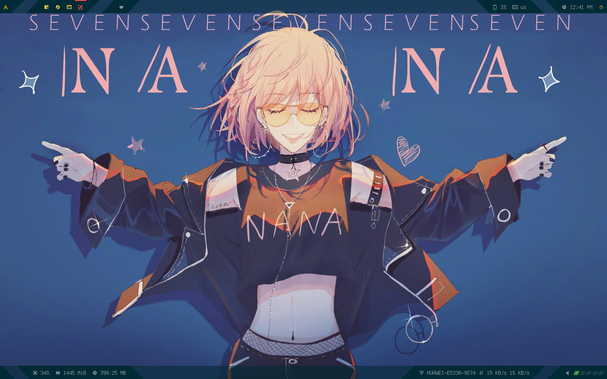
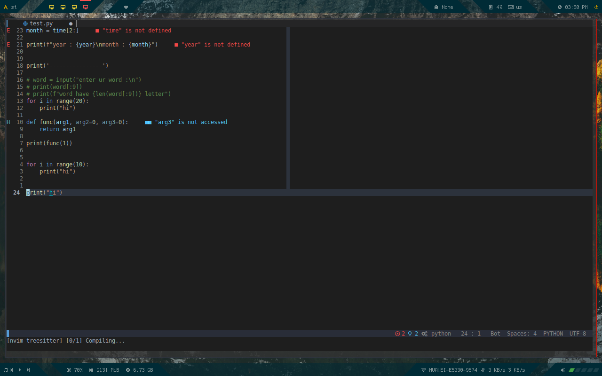
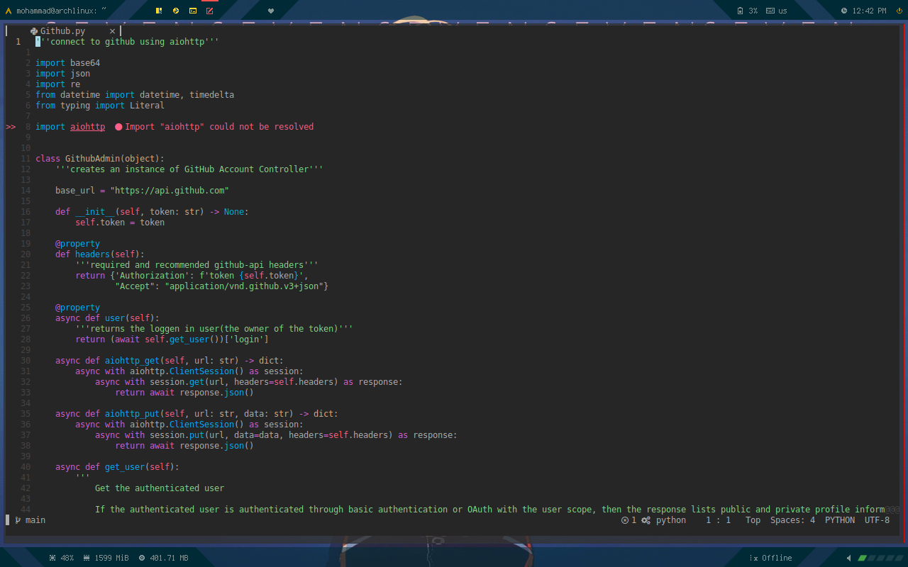

# dotfiles
requirements : 

- st
- polybar
- rofi
- feh
- lxsession
- compton
- mpd
- neovim + vim-plug
    
    
 
 font : awesome, nerd, JetBrains(for st)
  
 bumblebee-status only need for using i3bar if you want to use polybar it not Necessary

 
 
## nvim 
 

 Install vim plug for manage plugins and do `:PlugInstall`

### key mapping
leader key in my config is comma ','

| key map           | Description              |
|-------------------|--------------------------|
| jk, kj            | exit from normal mode    |
| tab , shift + tab | siwtch between buffers   |
| leader + t        | open Telescope           |
| leader + w        | close buffer             |
| ctrl + /          | comment toggle           |
| nnn               | open nnn                 |
| gs                | go to references (Lsp)   |
| gd                | go to definition (Lsp)   |
| ctrl + alt + f    | format with neoformat    |
| leader + s        | search word under cursor |
| leader + n        | open new buffer          |
| ctrl + l          | open nerd tree           |
