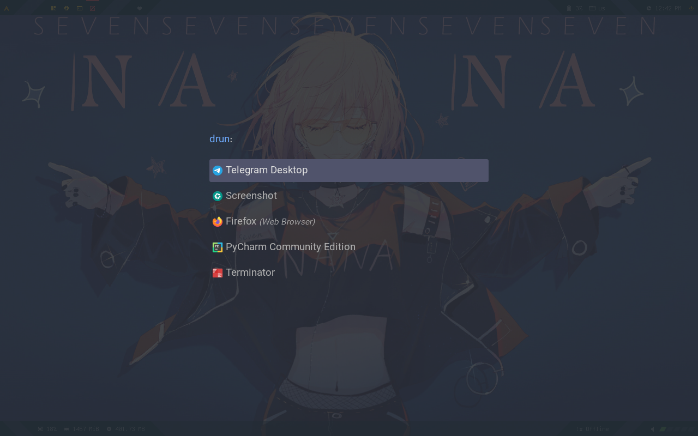

# dotfiles
requirements : 

- st
- polybar
- rofi
- feh
- lxsession
- compton
    
    
 
 font : awesome,nerd
  
 bumblebee-status only need for using i3bar if you want to use polybar it not Necessary

 nvim config use some config of lunarvim 

 
 
 
